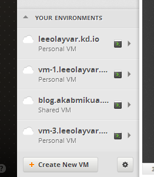
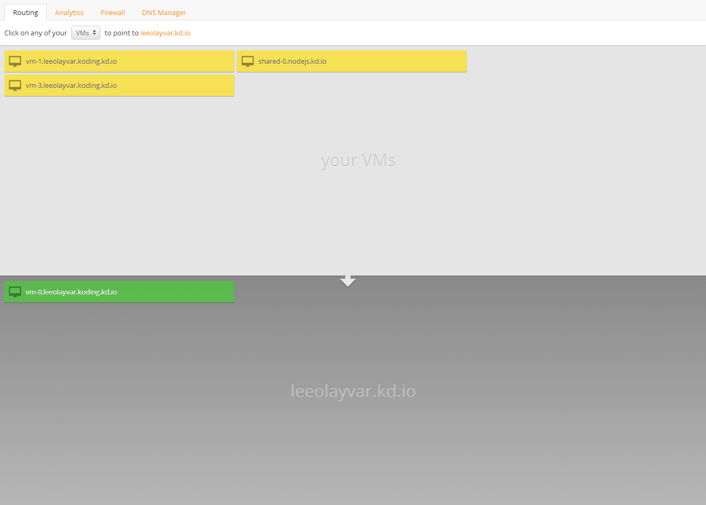
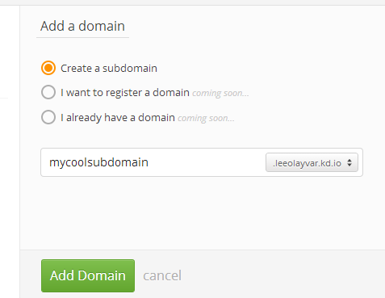

In this guide we will cover how to manage your Koding subdomains.

This will cover how to change which VM is shown when you connect to
your http://username.kd.io domain, as well as how to create additional
subdomains.

## Video

The following video link is a quick explanation of Domain Management.

<iframe width="680" height="450" src="//www.youtube.com/embed/31YloYb5kco" frameborder="0" allowfullscreen></iframe>

## Changing the username.kd.io VM

Here we will cover how to change the VM that you see when you connect
to `http://username.kd.io`.

1. First, go to **Your Environments**, which can be found in the lower right
  of your [Develop](http://koding.com/Develop) area, and click the Gear
  at the bottom. An image is below, the gear is in the lower right of the
  image.
  
  
  
2. Next, select your Username Domain *(username.kd.io)* and you will notice
  two large gray boxes. The gray boxes are populated with Yellow VMs, and
  a single Green VM. If you don't see a Green VM, it is because no VM is
  assigned to that domain. Below is an image of some example VMs..
  
  
  
3. To activate a VM, simply click on a Yellow VM. It will move from the
  light gray **Your VMs** box, and into the dark gray box becoming Green.
  
  The Green VM signifies it is enabled for that domain. Likewise, if
  you click on a Green VM, it removes that VM from that domain and it becomes
  yellow. Below is a picture of a Green VM.
  
  
  
  If, when you clicked on a Yellow VM, you received a popup notifying you
  that *"A domain name can only be bound to one VM."* it is because, as
  it says, a single domain can only point to a single VM at a time. Click on
  the Green VM, and then your desired Yellow VM, to swap the two.

## Creating Additional Domains

Creating domains is even simpler. Click on the **Add New Domain** button,
enter your new subdomain name, and click the green **Add Domain** button
on the bottom. Simple as that!

## Additional Resources

- [Domain Management](http://koding.com/Environments)

